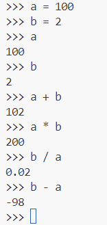

# Using python on the terminal

Before we look at using python files, first we are going to use python in the terminal.


## Checking Python Installation
For this to work Python must already be installed in the environment you are working in. It is pre-installed in UDAL.

To check if Python is installed and to see the version, open your terminal (we'll use the one inside VSCode) and type:

```
python --version
```


## Running python
Type into your terminal:

```
python
```

This should open up something that looks like this:


From here you can type commands straight into the terminal!

Try typing in a simple sum:

```
50 * 10
```
And it will return the answer! It can do this for any mathematical operation


It can also print things to the terminal:

Trying typing something like this - and remember the quotation marks!:

```
print("Hello World!")
```


This is all well and good, but what about storing variables?

Try storing a variable *greeting* by assigning it, using the = operator

```
greeting = "Hello World!"
```

Try running the "greeting" variable. Also check out the difference in returnign the variable and printing the variable. Note that when you're printing, you don't use the quotations marks. If you do, it will just print what is inside the quotation marks and not the value stored inside the variable!


You can overwrite variables so they will store something different. Let's try this by changing our greeting.


We don't have to just store strings (strings are anything enclosed in quotation marks "This is a string", "?/+352%" is also a string), we can store numbers too! This is handy because we can perform mathemtical operations with them. Try storing some numbers and performing some sums.



## Types

String is a type of variable, and there a few variable types. Some language require you to be explicit and always state what type of variable each variable is, but python will figure it out!


Types are important to know because we can't perform arithmetic operations on variables of different types. Try running this code:

```
greeting - a
```


Here: we get an error. Errors are really useful! We're told that this a "TypeError", which is do to with the variable types, and that it's because the operator "-" isn't supported for variables of type string (str) and integer (int).

```
type(a)
```


## How to exit python and return to yuor normal terminal

Simple - just type 
```quit()```
![]](images/quit.png)


## Summary

We have:

    - Opened python in the terminal
    - Used it to perform simple arithmetic problems
    - Printed strings to the terminal
    - Stored variables and printed them
    - Used variables to perform arithmetic problems
    - Seen our first error

Next time, we are going to do these things inside a python file. It's a lot easier to develop code in a file and then execute it, rather than executing it one line at a time
