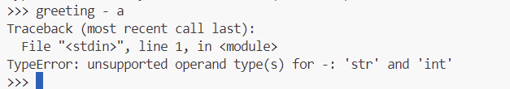
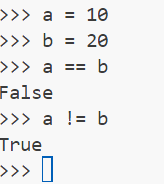

# Using Python on the Terminal

Before we look at using python files, first we are going to use python in the terminal.


## Checking Python Installation
For this to work Python must already be installed in the environment you are working in. It is pre-installed in UDAL.

To check if Python is installed and to see the version, open your terminal (we'll use the one inside VSCode) and type:

```
python --version
```


## Running Python
Type into your terminal:

```
python
```

This should open up something that looks like this:


From here you can type commands straight into the terminal!

Try typing in a simple sum:

```
50 * 10
```
And it will return the answer! It can do this for any mathematical operation


It can also print things to the terminal:

Trying typing something like this - and remember the quotation marks!:

```
print("Hello World!")
```


This is all well and good, but what about storing values?

Try storing a phrase and call it *greeting* by assigning it, using the = operator. We would now call *greeting* a variable.

```
greeting = "Hello World!"
```

Try running the "greeting" variable. Also check out the difference in returning the variable and use the print function with the variable. Note that when you're printing, you don't use the quotations marks. If you do, it will just print what is inside the quotation marks and not the value stored inside the variable!


You can overwrite variables so they will store something different. Let's try this by changing our greeting.


We don't have to just store strings (strings are anything enclosed in quotation marks *"This is a string"*, *"?/+352%"* is also a string), we can store numbers too! This is handy because we can perform mathematical operations with them. Try storing some numbers as variables and performing some sums.


## Types

String is a type of variable, and there a few variable types. Some languages require you to be explicit and always state what type of variable each variable is, but python will figure it out!


Types are important to know because we can't perform arithmetic operations on variables of different types. Try running this code:

```
greeting - a
```



Here: we get an error. Errors are really useful! We're told that this a "TypeError", which is do to with the variable types, and that it's because the operator "-" isn't supported for variables of type string (str) and integer (int).

We can find out the type of a variable by running:

```
type(a)
```

## String manipulation

While we can't adds strings and numbers togehter, we can add them to each other, and multiply them.

```
greeting = "Hi there, my name is"
name = "Jennifer"
```


Note here how we had to add in an extra space to make the sentence make sense, when adding strings Python will just stick them together!


We can also repeat strings - make sure you consider the spaces!

```
greeting = "'ello "
greeting_end = "- what's all this then?"
```


*Strings can be declared using single quotes too, but if you stick to double quotes you don't need to mess around in order to have apostrophes in your string*

### F-strings

What happens if we want to insert a number into our string? We can force an integer to change types to a string by using the "str()" function. This is called casting. Try our the example below.

```
balloons = 99
print("I have " + str(balloons) + " red balloons!"
```

There's a better way to do this, using an f-string. F-strings (formatted strings) are a new-ish addition to python (it's always being improved!). It's a nice a way you can insert a variable into a string and this is much neater as you don't need to add multiple strings together.

```
balloons = 99
print(f"I have {balloons} red balloons")
```


### Applying methods to strings

We can change the string too by applying a method (a method is a function attached to an object (a variable is a type of object))

```
sentence = "I feel so "
feeling = "angry"
sentence + feeling
```
Not quote angry enough....
Let's make it all uppercase

```
feeling = feeling.uppercase()
```

Try returning that now:


We can use ```.lower()``` as well, and that'll make everything lowercase.


## Comparison Operators

It can be really handy to check comparisons between variables. We can use comparison operators to do this and they will return a *Boolean* value (True or False). Note that to compare if two values are equal to each other we use ==, not =, this is because this would just reassign the variable!


Try comparing two variables using the operators in the image above.



## Logical Operators

Logical Operators are used to combine comparison statements. They are ```and```, ```or``` and ```not```. 
Try out the ones below - what results do you think you will get?

```
a == 10
b == 20
a >= 1 and b >= 10
???
a >= 100 or b <= 100
???
not(a == 10 and b == 20)
???

```


## How to Exit Python

Simple - just type  ```quit()```


Next time, we are going to do these things inside a python file. It's a lot easier to develop code in a file and then execute it, rather than executing it one line at a time.

## Exercises

In order to get some more practice using these: before the next session please read these pages

- Variables: https://www.w3schools.com/python/python_variables.asp (Just cover the first one in this section)
- Data Types: https://www.w3schools.com/python/python_datatypes.asp
- Numbers: https://www.w3schools.com/python/python_numbers.asp
- Casting: https://www.w3schools.com/python/python_casting.asp
- String Concatenation: https://www.w3schools.com/python/python_strings_concatenate.asp
- F-Strings: https://www.w3schools.com/python/python_strings_format.asp
